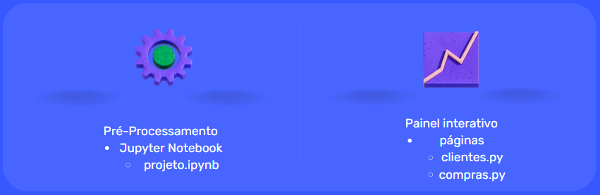
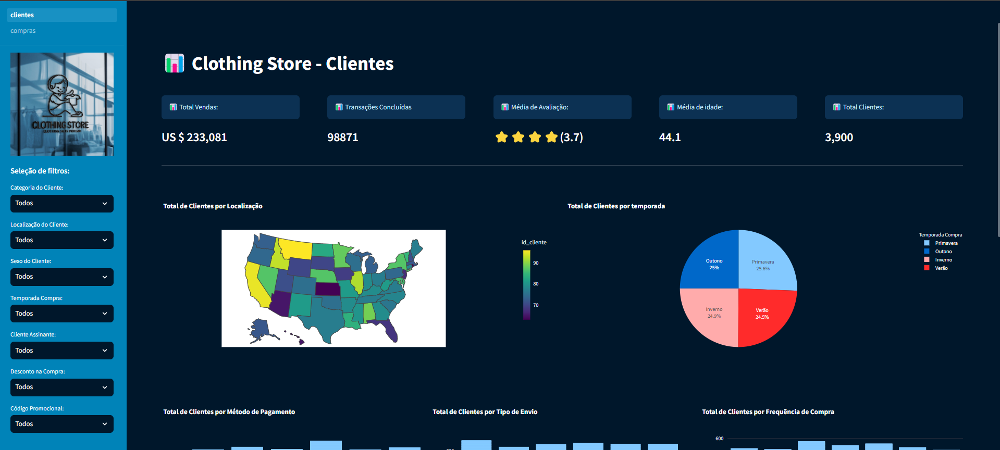
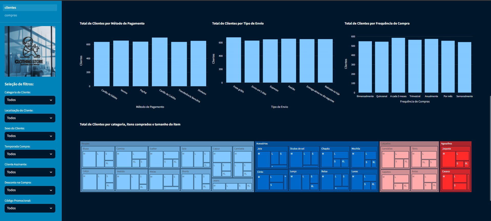
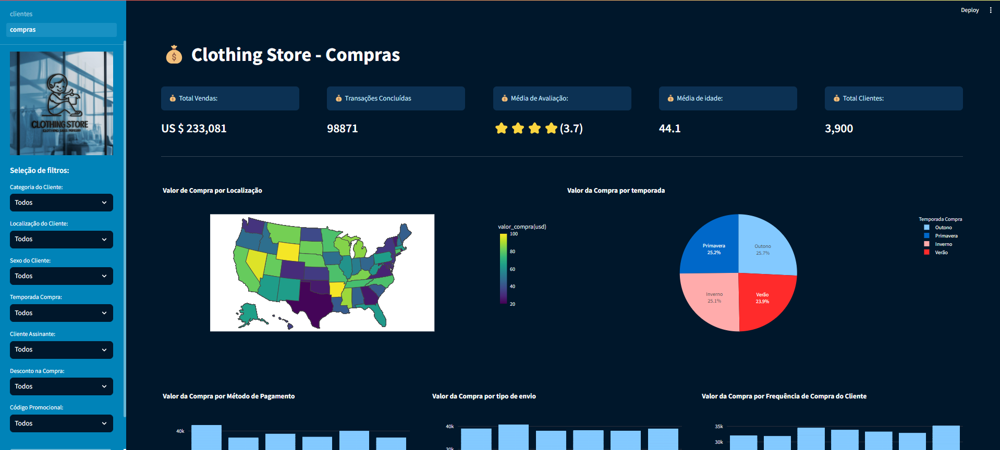
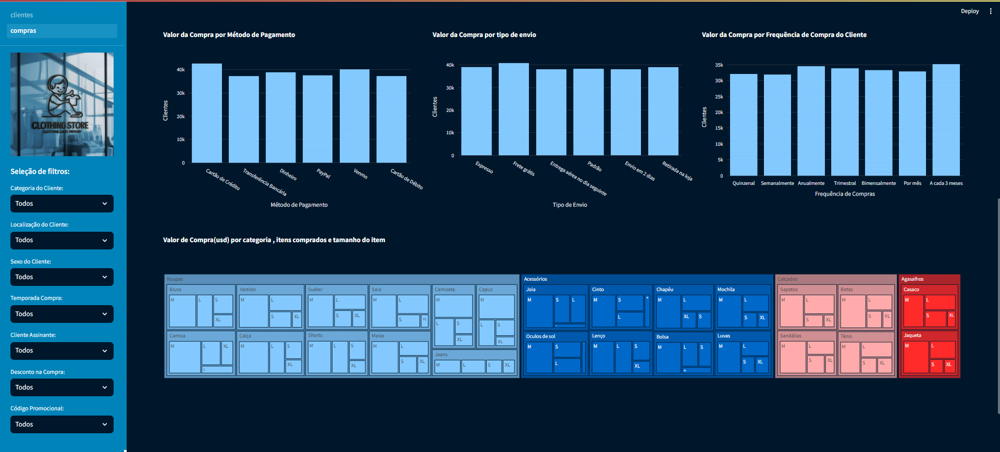

# Projeto de Desenvolvimento rápido de aplicações python: Painel Interativo de Perfil de Compra de Clientes

## 1. Arquitetura do Projeto:



## 2. Sobre o projeto: 

O seguinte projeto trata-se do desenvolvimento de um painel interativo construído em linguagem Python com as bibliotecas Plotly e Streamlit para visualização de dados e as bibliotecas pandas e Numpy para manipulação de dados. O dataset utilizado neste projeto foi baixado neste [link](https://www.kaggle.com/datasets/iamsouravbanerjee/customer-shopping-trends-dataset) e tem o registro de 3900 clientes com 18 colunas de uma loja de roupas dos Estados Unidos, que nesse projeto denominamos a loja com o nome “Clothing Store” e criamos uma logo para representá-la e fazer parte do painel interativo, com as visualizações, filtros e cartões, ambos, com o intuito de facilitar a tomada de decisões informadas e entregar um projeto visualmente elegante. O projeto seguiu etapas de pré-processamento de dados em um arquivo jupyter notebook e construção do painel interativo com duas páginas em arquivos py, além de discussões e planejamento sobre como entregar um projeto útil para os tomadores de decisão. 

## 3. Atributos do dataset: 

| Campo                  | Descrição                                                                 |
|------------------------|--------------------------------------------------------------------------|
| **Customer ID**        | Identificador exclusivo para cada cliente                                |
| **Age**                | Idade do cliente                                                         |
| **Gender**             | Gênero do cliente (Masculino/Feminino)                                    |
| **Item Purchased**     | O item comprado pelo cliente                                             |
| **Category**           | Categoria do item adquirido                                              |
| **Purchase Amount (USD)** | O valor da compra em USD                                              |
| **Location**           | Local onde a compra foi realizada                                        |
| **Size**               | Tamanho do item adquirido                                                |
| **Color**              | Cor do item adquirido                                                    |
| **Season**             | Temporada durante a qual a compra foi feita                              |
| **Review Rating**      | Classificação dada pelo cliente para o item comprado                     |
| **Subscription Status**| Indica se o cliente possui uma assinatura (Sim/Não)                      |
| **Shipping Type**      | Tipo de envio escolhido pelo cliente                                     |
| **Discount Applied**   | Indica se foi aplicado desconto na compra (Sim/Não)                      |
| **Promo Code Used**    | Indica se um código promocional foi usado para a compra (Sim/Não)        |
| **Previous Purchases** | A contagem total de transações concluídas pelo cliente na loja, excluindo a transação em andamento |
| **Payment Method**     | Método de pagamento preferido do cliente                                 |
| **Frequency of Purchases** | Frequência com que o cliente realiza compras (ex: Semanal, Quinzenal, Mensal) |


## 4. Desenvolvimento:

### 4.1 Pré-processamento dos Dados

* Verificação da estrutura do projeto, valores nulos e duplicatas.
* Dados estavam em ótimo formato, sem necessidade de modificações.
* Por motivos didáticos e de fácil interpretação, foi decidido traduzir os dados de inglês para português.
   - Renomeação de colunas e valores categóricos.
* Criação de uma coluna adicional baseada na localização dos clientes.
   - Inclusão dos códigos dos estados americanos para reconhecimento no gráfico do mapa.
* Salvamento do arquivo modificado denominado como `df`.
* Este arquivo será utilizado nas análises na etapa da construção do painel interativo.

### 4.2 Painel Interativo

* Optou-se por  construir duas páginas com a biblioteca Streamlit:
   - **Primeira Página**: Focada na distribuição de clientes.
   - **Segunda Página**: Focada nos valores de compra dos clientes.
* Ambas as páginas possuem:
   - **Sidebar**: Botões de navegação, logo da loja e filtros.
   - **Conteúdo Principal**: Cartões KPIs relevantes e gráficos.
* Tipos de gráficos utilizados: barras, setores, treemap e mapa.
   - Objetivo: Variar os gráficos no projeto e facilitar a geração de insights.

**Primeira Página**:

* Seis gráficos referentes à contagem de clientes:
   - Gráfico de mapa: Quantidade de clientes por localização.
   - Gráfico de pizza: Clientes por temporada.
   - Três gráficos de barra: Métodos de pagamento, tipo de envio e frequência de compra dos clientes.
   - Gráfico treemap: Categoria do produto, item comprado e tamanho do item.
* Objetivo: Visão geral da quantidade de clientes na loja segundo diferentes atributos.

<table>
  <tr>
    <td></td>
    <td></td>
  </tr>
</table>

**Segunda Página**:

* Seis gráficos referentes ao valor de compra dos clientes:
   - Gráfico de mapa: Valor total em cada localização.
   - Gráfico de pizza: Valor comprado por temporada.
   - Três gráficos de barra: Valores de compra por métodos de pagamento, tipo de envio e frequência de compra dos clientes.
   - Gráfico treemap: Total comprado por categoria do produto, item comprado e tamanho do item.
* Objetivo: Visão geral da situação de compra dos clientes na loja segundo diferentes colunas do dataset.

<table>
  <tr>
    <td></td>
    <td></td>
  </tr>
</table>

📍 [Link do Deploy do Painel Interativo](https://clothingstore.streamlit.app/)

## 5. Equipe:

1. [Micael José de Lima](https://github.com/micaellimaj)
2. [Enrico Cassimiro Vertano Germânio](https://github.com/EnricoCassimiro)
3. [Fernando Torres da Silva](https://github.com/Fernalss)


## 6. Importações de Bibliotecas:

```
import streamlit as st
import pandas as pd
import numpy as np
import plotly.express as px
from PIL import Image

```

## 7. Estrutura do Repositório:

------------


    ├── requirements.txt          <- O arquivo de requisitos para reproduzir o ambiente de análise, por exemplo, gerado com `pip congelamento > requisitos.txt
    │
    ├── LICENSE
    │
    ├── README.md                 <- O Readme de nível superior para desenvolvedores que usam esse projeto
    │ 
    ├── streamlit                 <- configuração do design do layout
    │
    ├── Imagem                    <- Contém a logo do projeto
    │
    ├── Documentação              <- Contém a documentação do projeto e a apresentação feita em sala de aula
    │
    ├── pages                     <- Contém a páginas utilizadas no projeto, aqui apenas a 2º página
    │   
    ├── 1_clientes                <- Página principal de inicialização do projeto
    │ 
    ├── painel                    <- Capturas do painel interativo e arquitetura
    │ 
    ├── datasets                  <- datasets utilizados no projeto, incluindo o arquivo original e o arquivo após o processamento.
    │   ├── shopping_trends.csv   <- datasets de perfil de clientes original
    │   ├── df.csv                <- datasets modificado
    │
    └──notebook                   <- caderno jupyter notebook utilizado para o pré-processamento de dados
    
## 8. Referências : 

Conteúdos de referência:
* [youtube](https://youtu.be/nPz88occPYw?si=OeO1va0WgSn-uBAg)/
[youtube](https://youtu.be/pWxDxhWXJos?si=GWELoHAVm6PRR8Cs)/
[youtube](https://youtu.be/Sb0A9i6d320?si=i3XI849cJuHd1XdK)
* [documentação-streamlit](https://streamlit.io/)/
[documentação-plotly](https://plotly.com/python/)


